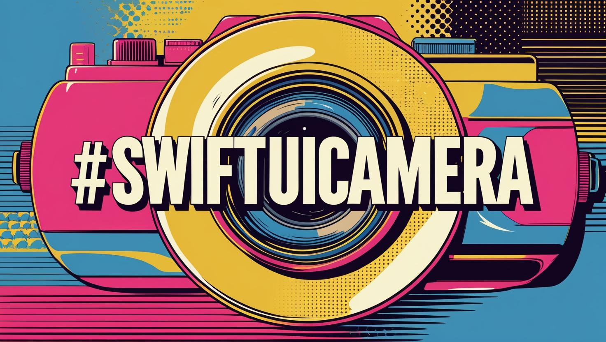
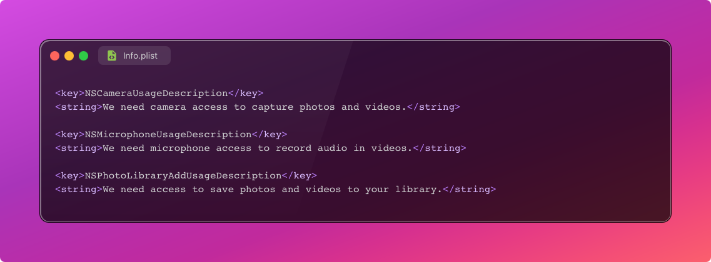
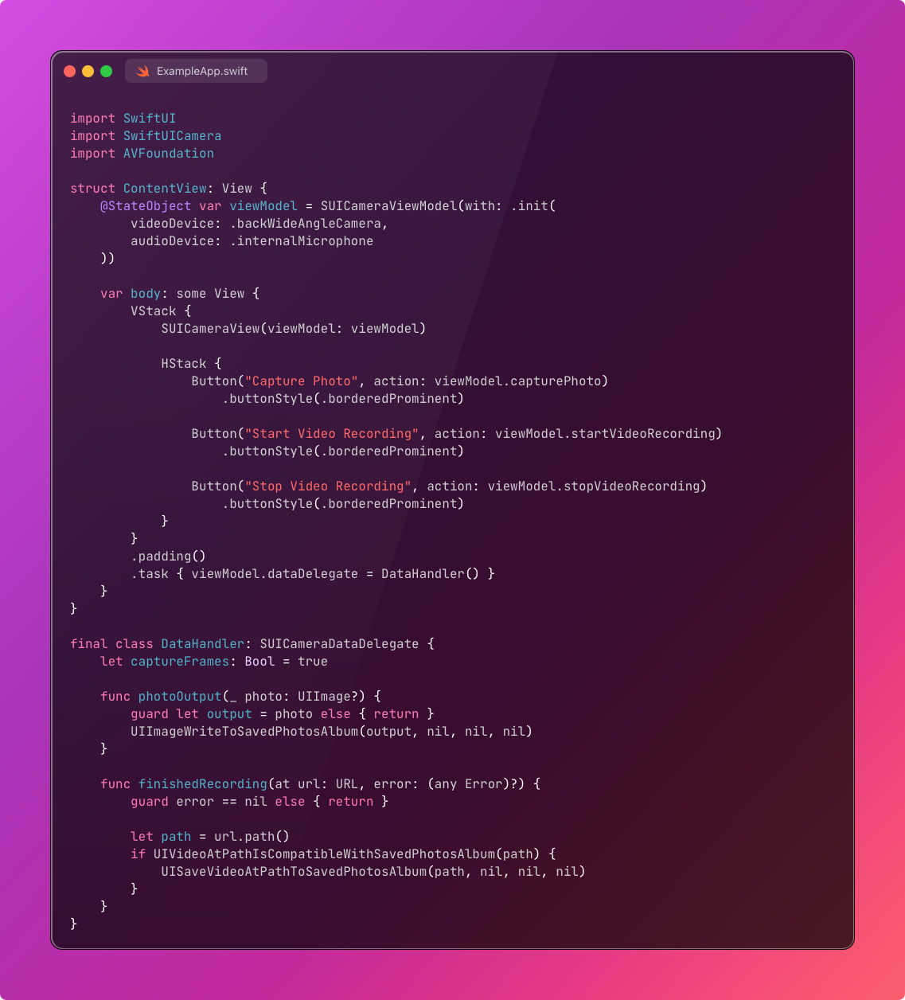
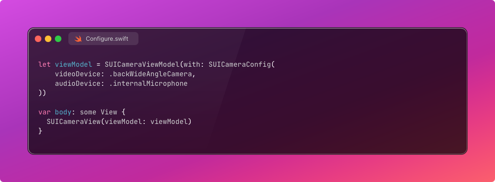
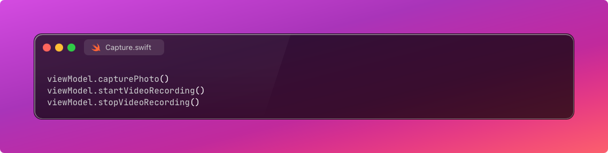
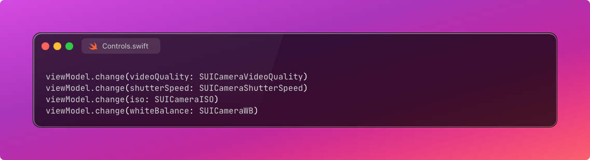

# SwiftUICamera

**Seamless camera integration for SwiftUI.**

SwiftUICamera makes it effortless to add rich camera functionality to your SwiftUI applications — with support for photo capture, video recording, live frame output, and full control over camera hardware.

---

## 📸 Features

- Easy integration with SwiftUI using `SUICameraView`
- Capture photos and record videos
- Access real-time camera frames as `UIImage` or `CIImage`
- Control over:
  - Video quality
  - Shutter speed
  - ISO
  - White balance
- Simple delegate protocol for receiving media output
- Upcoming support for:
  - Lens switching (wide/ultrawide/telephoto)
  - Zoom and focus control
  - Flash toggle
  - ProRAW capture

---

## 🚀 Getting Started

### 🔧 Installation

#### ✅ Swift Package Manager

1. Open your Xcode project.
2. Navigate to **File > Add Packages**.
3. Enter the SwiftUICamera repository URL:
   ```
   https://github.com/k-arindam/SwiftUICamera.git
   ```
4. Choose the latest version and add it to your app target.

---

## 🛠️ Setup

### 📄 Info.plist

To access the camera, microphone, and save media to the Photo Library, add the following entries in your app's `Info.plist`:



---

## 📦 Example Usage



---

## 🧰 API Reference

### 🔍 `SUICameraViewModel`

Create and configure a camera session:



### 📸 Capture Photos and Videos



### ⚙️ Camera Controls



(*Upcoming APIs: focus, zoom, lens toggle, flash, ProRAW*)

---

### 🔄 SUICameraDataDelegate

Set a delegate to receive output:

```swift
viewModel.dataDelegate = YourDelegate()
```

#### Optional Methods

```swift
func photoOutput(_ photo: AVCapturePhoto, error: Error?)
func photoOutput(_ photo: UIImage?)
func finishedRecording(at url: URL, error: Error?)
func frameOutput(ciImage: CIImage)
func frameOutput(original uiImage: UIImage?)
func frameOutput(rotated uiImage: UIImage?)
```

---

## 🔐 Privacy

This package uses device camera and microphone. Make sure your app clearly informs users why access is required.

---

## 📦 Legal

- [MIT License](LICENSE)
- [Code of Conduct](CODE_OF_CONDUCT.md)

---

## 💬 Feedback / Contributions

We welcome pull requests, suggestions, and issues. Let’s build the most seamless camera experience in SwiftUI!

---

## 🔗 Links

- [Apple Documentation on AVFoundation](https://developer.apple.com/documentation/avfoundation)
- [SwiftUI Documentation](https://developer.apple.com/documentation/swiftui)
